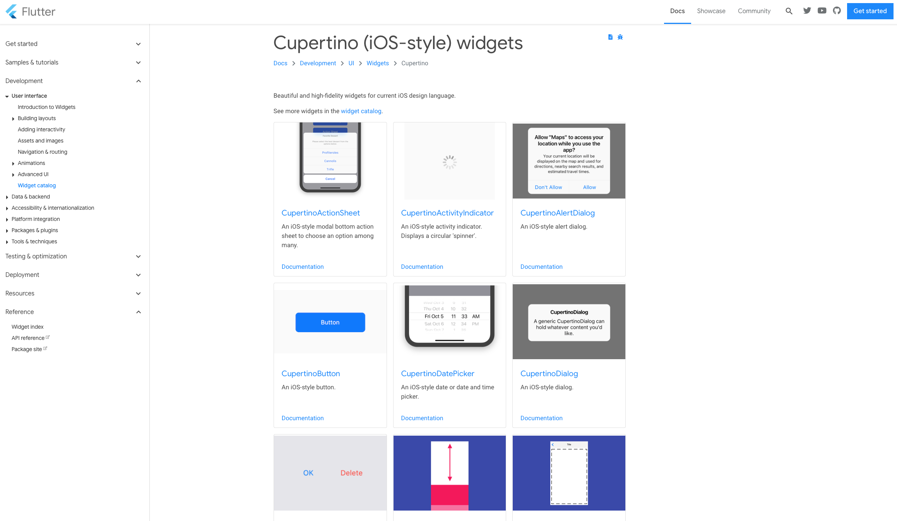

theme: Ostrich, 1
autoscale: true
build-lists: true
footer: © Tailor your 


# Flutter


---

# AGENDA

1. Introduction
2. Comparison to iOS
3. Live coding + workshops
4. Conclusion

---

# Introduction

---

### Reactive cross-platform mobile development framework that uses Dart language

---

# **IDE**

• Android Studio, 
• IntelliJ Idea,
• Visual Studio Code.

---

## Writing UI in **declarative** way

---

## Refreshing UI

---


---

[.code-highlight: 1-6]
[.code-highlight: 7-12]


```dart
// Imperative style

b.setColor(red)
b.clearChildren()
ViewC c3 = new ViewC(...)
b.add(c3)

// Declarative style

return ViewB(
  color: red,
  child: ViewC(...),
)
```
---

**UI elements triggers a rebuild on itself** (most commonly by calling **setState()**) and constructs a new Widget subtree.

---

## State of layout managed by **framework**

---

## Comparison to **iOS**

---

### **Widget** is equivalent of **UIView**

---

### **Widget** ≠ **UIView**

---

# **UIVIEW**

**mutable entity** that is drawn once and doesn’t redraw until it's invalidated using **setNeedsDisplay()**.

---

# **WIDGET**

1. Different lifespan
2. Immutable
3. Exist only until they need to be changed
4. Description of the UI (**view object under the hood**)

---

## **TYPES OF WIDGET**

1. Stateless**Widget**
2. Statefull**Widget**

---

### If a widget changes outside of the build method **it’s stateful**

---


---


---

# COMPONENTS

---

 
### Material components

---

 
### Cupertino components

---

### LIVE CODING / WORKSHOPS

---

# CONCLUSION
